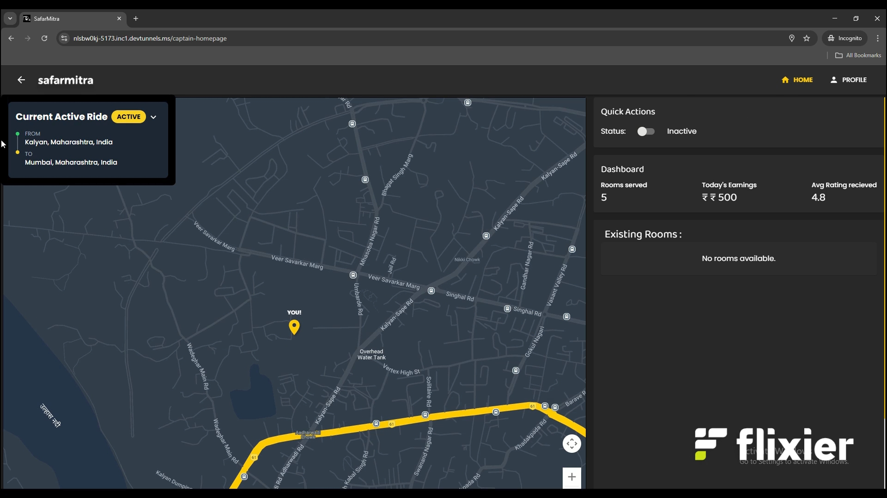

# SafarMitra

SafarMitra is a taxi pooling app designed to make travel more affordable and convenient for daily commuters. It allows users to create and join rooms based on a shared start location and destination, helping them find fellow passengers to split taxi fares efficiently. By connecting commuters heading in the same direction, SafarMitra promotes cost-effective and hassle-free travel.

## 🎯 Who is it for?

SafarMitra is designed for commuters who want to share taxis for daily commutes, reducing travel costs while ensuring a comfortable and secure ride.

<details>
<summary>Table of Contents</summary>

- [Description](#description)
- [Tech Stack](#tech-stack)
- [Progress](#progress)
- [Future Scope](#future-scope)
- [Applications](#applications)
- [Project Setup](#project-setup)
- [Usage](#usage)
- [Team Members](#team-members)
- [Mentors](#mentors)
- [Screenshots](#screenshots)

</details>

## 🤖Tech-Stack

Mention all languages/libraries/frameworks used in your project **domain-wise**  
You can use icons too - find them [here](https://github.com/get-icon/geticon)

#### Front-end

- React
- Tailwind
- JavaScript
- MaterialUI

#### Back-end

- NodeJS
- ExpressJS
- Multer
- Socket IO
- Google maps API
- JWT

#### Database

- MongoDB

## 🌍 What SafarMitra does ?

SafarMitra offers a range of practical applications, making travel easier and more efficient for college students:

- **Cost-Effective Travel** – Helps students save money by sharing taxi fares with others traveling on the same route.
- **Campus Commuting** – Ideal for students commuting between college, hostels, and home, reducing travel expenses.
- **Smart Ride Coordination** – Enables users to create and join ride rooms, ensuring quick and efficient taxi pooling.
- **Enhanced Safety** – Restricts access to verified college students, ensuring a secure ride-sharing environment.
- **Time-Saving** – Reduces waiting time by quickly matching passengers heading in the same direction.
- **Eco-Friendly Travel** – Promotes shared rides, reducing traffic congestion and carbon footprint.
- **Digital Convenience** – Provides a seamless, user-friendly interface for easy ride management.

SafarMitra is designed to **enhance mobility, improve affordability, and ensure safety** for students relying on taxis for daily travel! 🚖✨

## 🛠Project Setup

For the Web-App 1.Clone the GitHub repo.

```bash
git clone <url>
```

2.Enter the client directory. Install all the required dependencies.

```bash
  cd frontend
  npm install
  npm start
```

3.To start the backend server:4

```bash
  cd backend
  npm install
  npm start
```

## 👨‍💻Team Members

Add names of your team members with their emails and links to their GitHub accounts

- [Yogesh Palve ](https://github.com/Yogesh-Palve) :(yogesh.palve.clg@gmail.com)
- [Chaitanya Shinde ](https://github.com/Chaitanya-666): (orionck545@gmail.com)
- [Sahil Waje ](https://github.com/sahilwaje23):(sahilwaje645@gmail.com)
- [Ritesh Saindane ](https://github.com/Ritesh-Saindane):(ritesh.saindane.st@gmail.com)

## 👨‍🏫Mentors

Inheritance Mentors for SafarMitra

- [Vedant Kale ](https://github.com/Manav39)
- [Manav Shah](https://github.com/VedantKale08)

## 📱Screenshots

### 👤 User Flow

**1. User Home Page**  


**2. Booking a Ride**  


**3. Create or Join a Room**  


**4. Room Interior**  


**5. Home Page After Accepting Ride**  


---

### 🚗 Driver Flow

**6. Driver Home Page**  


**7. Driver Room Interior**  


**8. Driver Home After Accepting Ride**  


**9. Driver Profile Page**  


## 🎥 Demo Videos

Video demonstrating how a Mitra gets added to an existing room:
[📹 Demonstration Video](images/11.mp4)

### 📱 Mobile View Screenshots

**1. Signup Page**  


**2. User Profile Page**  


**3. Driver Homepage After Accepting Ride**  


**4. Driver Room Interface**  


**5. Room Interior Chat Page**  


Thankyou.
